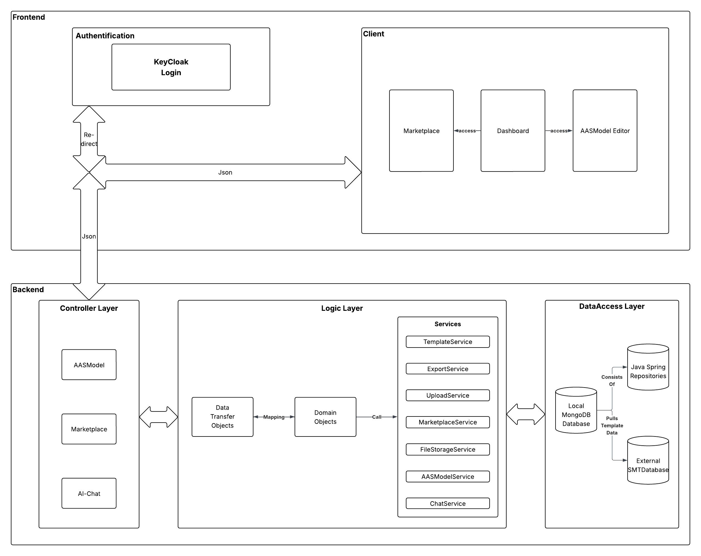
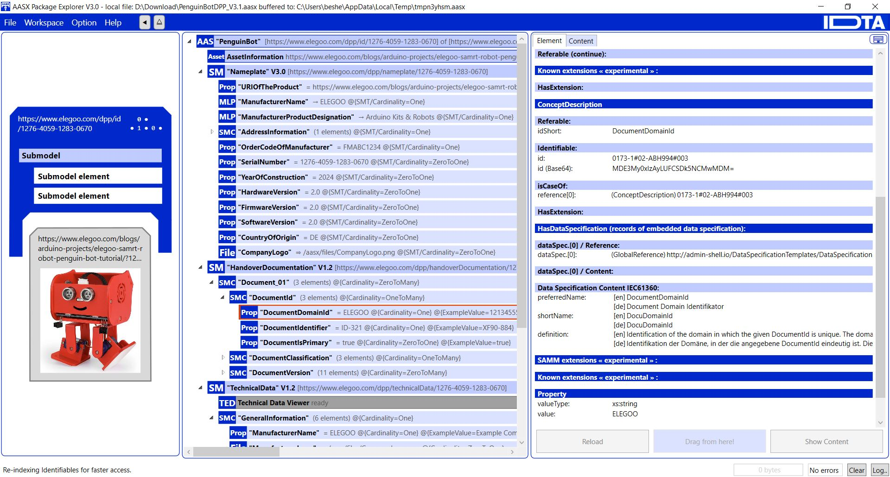

# 🌐 DigiTwin Studio - Digital Twin Submodel Instantiation Platform

**DigiTwin Studio** is a modern, full-stack web application, collaboratively designed and implemented by a team of four students as part of an academic software engineering project at Fraunhofer IOSB Karlsruhe. The platform simplifies the complex process of creating Asset Administration Shell (AAS) models by providing an intuitive web interface that bridges the gap between the powerful but complex AASX Package Explorer and user-friendly model creation.

Built with **React**, **Spring Boot**, **Keycloak**, and **MongoDB**, fully containerized with **Docker** and deployed on **Railway** - featuring **over 52 backend classes** and **300+ JUnit tests** ensuring professional code quality and reliability.

[](https://bescher-digitwins.up.railway.app)
[](https://github.com/Bescher-Kilani/Digital-Twins)
[](https://github.com/Bescher-Kilani/Digital-Twins)
[](https://github.com/Bescher-Kilani/Digital-Twins)
[](https://github.com/Bescher-Kilani)


---

## 🚀 Features

- **📋 Template Management** - Automated retrieval of latest Submodel-Templates from IDTA repository
- **👥 User Authentication** - OAuth2/JWT with Keycloak for secure user management
- **🎯 Intuitive Form Interface** - Simplified AAS model creation with step-by-step guidance
- **💾 Model Persistence** - Save and manage your Digital Twin models
- **📦 Export Options** - Download models in AASX or JSON format
- **🔍 ModelHub Search** - Discover and share published models with the community
- **👤 Guest Mode** - Try the platform without registration
- **🎨 Modern UI** - Responsive design with beautiful user experience
- **✅ Comprehensive Testing** - Over 300 JUnit tests ensuring reliability and code quality

---

## 🛠️ Tech Stack

### **Frontend**
- **React 18** - Modern React with Hooks
- **Vite** - Lightning-fast build tool
- **React Router** - Client-side routing
- **Axios** - HTTP client for API calls
- **OAuth2** - Keycloak integration for authentication
- **i18next** - Internationalization (German/English)

### **Backend**
- **Spring Boot 3.5** - Java REST API
- **Spring Security** - OAuth2 resource server
- **MongoDB** - NoSQL database for model storage
- **Maven** - Dependency management
- **Lombok** - Reduce boilerplate code
- **AAS4J** - Asset Administration Shell library
- **MapStruct** - Object mapping
- **JUnit 5** - Comprehensive testing suite with 300+ tests

### **Authentication**
- **Keycloak 24** - Identity and Access Management
- **OAuth2/JWT** - Token-based authentication
- **PKCE Flow** - Secure authorization code flow

### **DevOps**
- **Docker** - Containerization
- **Docker Compose** - Multi-container orchestration
- **Railway** - Cloud deployment platform
- **Nginx** - Production web server for frontend

---

## 📦 System Architecture

### **High-Level Architecture**



Our system follows a microservices architecture with clear separation of concerns:

- **Frontend Layer**: React SPA served by Nginx
- **Backend Layer**: Spring Boot REST API with business logic
- **Authentication Layer**: Keycloak for identity and access management
- **Data Layer**: MongoDB for application data

### **The AASX Package Explorer Integration**



One of the main challenges this project solves is simplifying the complex process of creating AAS models. The [AASX Package Explorer](https://github.com/eclipse-aaspe/package-explorer) is a powerful tool for working with Digital Twins, but it requires extensive knowledge of the AAS specification and can be overwhelming for new users.

**DigiTwin Studio bridges this gap by:**
- Providing an intuitive web interface for model creation
- Automatically handling complex AAS structure requirements
- Generating valid AASX files that can be opened directly in AASX Package Explorer
- Validating models against AAS specifications before export
- Making Digital Twin modeling accessible to users without deep AAS expertise

As shown in the screenshot above, models created in DigiTwin Studio can be seamlessly opened and further edited in AASX Package Explorer, combining the ease of our web interface with the power of professional tooling.

---

## 🐳 Docker Setup

This project uses **Docker Compose** for local development with multi-container orchestration:

### **Services Architecture**

- **Frontend**: React app with Nginx (Port 3000)
- **Backend**: Spring Boot REST API (Port 9090)
- **Keycloak**: Authentication server (Port 8080)
- **MongoDB**: Application database (Port 27017)

### **Container Networking**

Services communicate via Docker's internal network:
```
frontend:3000 → backend:9090
backend:9090 → keycloak:8080 (internal)
backend:9090 → mongodb:27017
```

---

## 🚀 Quick Start

### **Prerequisites**
- Docker Desktop (or Docker Engine + Docker Compose)
- Git

### **1. Clone the Repository**
```bash
git clone https://github.com/Bescher-Kilani/DigiTwin-Studio.git
cd DigiTwin-Studio
```

### **2. Configure Environment Variables**
Create a `.env` file in the root directory:
```env
# MongoDB
MONGODB_ROOT_USERNAME=admin
MONGODB_ROOT_PASSWORD=password123
MONGODB_DATABASE=digitwin
MONGODB_PORT=27017

# Keycloak
KEYCLOAK_ADMIN=admin
KEYCLOAK_ADMIN_PASSWORD=admin123
KEYCLOAK_PORT=8080

# Backend
BACKEND_PORT=9090

# Frontend
FRONTEND_PORT=3000
```

### **3. Start with Docker Compose**
```bash
# Build and start all services
docker-compose up --build -d

# View logs
docker-compose logs -f

# View specific service logs
docker-compose logs -f backend

# Stop all services
docker-compose down

# Stop and remove volumes (⚠️ deletes all data)
docker-compose down -v
```

### **4. Access the Application**
- **Frontend**: http://localhost:3000
- **Backend API**: http://localhost:9090
- **Backend Health**: http://localhost:9090/actuator/health
- **Keycloak Admin**: http://localhost:8080/admin (admin/admin123)

### **5. Initial Setup**
The Keycloak realm is automatically configured on first startup. No manual configuration needed!

---

## 🌐 Railway Deployment

**Live Application**: [https://bescher-digitwins.up.railway.app](https://bescher-digitwins.up.railway.app)

This project is deployed on Railway with automatic CI/CD. Every push to the `main` branch triggers:
- Automatic Docker build on Railway
- Deployment to production environment
- Health checks to verify deployment
- Zero-downtime rolling updates

### **Deployment Architecture**

Railway services:
1. **Frontend** - React app with Nginx
2. **Backend** - Spring Boot API
3. **Keycloak** - Authentication service
4. **MongoDB** - Application database

### **⚡ Serverless Mode (Cost Optimization)**

Railway's Serverless feature automatically sleeps inactive services to reduce costs:

**How it works:**
- Services sleep after **10 minutes of inactivity** (no outbound traffic)
- First request after sleep causes a **~20 second cold start**
- Subsequent requests are instant (normal response time)
- Automatically wakes on incoming traffic

---

## 📁 Project Structure
```
DigiTwin-Studio/
├── Backend/                                    # Spring Boot Backend (52+ Classes)
│   ├── src/main/java/org/DigiTwinStudio/DigiTwin_Backend/
│   │   ├── adapter/                           # External Library Adapters
│   │   │   ├── AAS4jAdapter.java
│   │   │   └── MultipartFileAdapter.java
│   │   │
│   │   ├── config/                            # Configuration Classes
│   │   │   ├── CorsConfig.java
│   │   │   ├── MongoConfig.java
│   │   │   └── SecurityConfig.java
│   │   │
│   │   ├── controller/                        # REST Controllers (8 controllers)
│   │   │   ├── AASModelController.java
│   │   │   ├── ExportController.java
│   │   │   ├── FileUploadController.java
│   │   │   ├── HealthController.java
│   │   │   ├── MarketPlaceController.java
│   │   │   ├── SubmodelController.java
│   │   │   ├── TagController.java
│   │   │   └── TemplateController.java
│   │   │
│   │   ├── domain/                            # Domain Models (12+ entities)
│   │   │   ├── AASModel.java
│   │   │   ├── ExportedFile.java
│   │   │   ├── MarketplaceEntry.java
│   │   │   ├── SubmodelElementType.java
│   │   │   ├── Template.java
│   │   │   └── ...
│   │   │
│   │   ├── dtos/                              # Data Transfer Objects (15+ DTOs)
│   │   │   ├── AASModelDto.java
│   │   │   ├── CreateModelRequestDto.java
│   │   │   ├── MarketplaceEntryDto.java
│   │   │   ├── SubmodelDto.java
│   │   │   └── ...
│   │   │
│   │   ├── exceptions/                        # Custom Exceptions
│   │   │   ├── GlobalExceptionHandler.java
│   │   │   ├── NotFoundException.java
│   │   │   ├── BadRequestException.java
│   │   │   └── ...
│   │   │
│   │   ├── integration/                       # External Integrations
│   │   │   └── SMTRepoClient.java
│   │   │
│   │   ├── mapper/                            # MapStruct Mappers (8+ mappers)
│   │   │   ├── AASModelMapper.java
│   │   │   ├── SubmodelMapper.java
│   │   │   ├── TemplateMapper.java
│   │   │   └── ...
│   │   │
│   │   ├── repositories/                      # MongoDB Repositories (5 repos)
│   │   │   ├── AASModelRepository.java
│   │   │   ├── MarketPlaceEntryRepository.java
│   │   │   ├── TemplateRepository.java
│   │   │   └── ...
│   │   │
│   │   ├── services/                          # Business Logic (9 services)
│   │   │   ├── AASModelService.java
│   │   │   ├── ExportService.java
│   │   │   ├── FileStorageService.java
│   │   │   ├── MarketPlaceService.java
│   │   │   └── ...
│   │   │
│   │   ├── validation/                        # Validators (4 validators)
│   │   │   ├── AASModelValidator.java
│   │   │   ├── FileUploadValidator.java
│   │   │   └── ...
│   │   │
│   │   └── DigiTwinApplication.java           # Main Application
│   │
│   ├── src/test/java/                         # Test Suite (300+ tests)
│   │   └── org/DigiTwinStudio/DigiTwin_Backend/
│   │       ├── controller/                    # Controller Tests
│   │       ├── services/                      # Service Tests
│   │       ├── mapper/                        # Mapper Tests
│   │       ├── validation/                    # Validator Tests
│   │       └── integration/                   # Integration Tests
│   │
│   ├── src/main/resources/
│   │   └── application.properties
│   ├── Dockerfile                             # Production (Railway)
│   ├── Dockerfile.local                       # Local development
│   └── pom.xml                                # Maven dependencies
│
├── Frontend/                                   # React Frontend
│   ├── src/
│   │   ├── assets/                            # Static assets
│   │   ├── components/                        # Reusable React components
│   │   │   ├── form_inputs/                   # Form input components
│   │   │   │   ├── Prop.jsx
│   │   │   │   ├── AssetKind.jsx
│   │   │   │   └── ...
│   │   │   ├── Layout.jsx
│   │   │   └── ProtectedRoute.jsx
│   │   │
│   │   ├── pages/                             # Page components
│   │   │   ├── home.jsx
│   │   │   ├── dashboard.jsx
│   │   │   ├── marketplace.jsx
│   │   │   ├── createPage.jsx
│   │   │   └── ...
│   │   │
│   │   ├── styles/                            # CSS stylesheets
│   │   ├── locales/                           # i18n (German/English)
│   │   │   ├── de/translation.json
│   │   │   └── en/translation.json
│   │   │
│   │   ├── utils/                             # Utility functions
│   │   ├── App.jsx                            # Main app & routing
│   │   ├── main.jsx                           # Entry point
│   │   └── KeycloakContext.jsx                # Keycloak integration
│   │
│   ├── nginx.conf                             # Nginx configuration
│   ├── Dockerfile                             # Production (Railway)
│   ├── Dockerfile.local                       # Local development
│   └── package.json                           # NPM dependencies
│
├── keycloak-import/                           # Keycloak Configuration
│   └── digitwin-realm.json                    # Realm configuration
│
├── docs/                                      # Documentation & Screenshots
│   └── images/
│
├── docker-compose.yml                         # Local development
├── .env.example                               # Environment template
└── README.md                                  # This file
```

**📊 Project Statistics:**
- **Backend Classes**: 52+ Java classes across multiple packages
- **Controllers**: 8 REST controllers
- **Services**: 9 business logic services
- **Repositories**: 5 MongoDB repositories
- **DTOs**: 15+ data transfer objects
- **Mappers**: 8+ MapStruct mappers
- **Validators**: 4 custom validators
- **Frontend Pages**: 10+ React page components
- **Frontend Components**: 15+ reusable components
- **Tests**: 300+ JUnit tests
- **Internationalization**: Full German and English support

---

## 🔐 Authentication Flow

### **OAuth2 PKCE Flow with Keycloak**

```
┌─────────┐                                      ┌──────────┐
│ Browser │                                      │ Keycloak │
└────┬────┘                                      └────┬─────┘
     │                                                │
     │ 1. Login Request                               │
     ├────────────────────────────────────────────────▶
     │                                                │
     │ 2. Login Page                                  │
     │◀───────────────────────────────────────────────┤
     │                                                │
     │ 3. Credentials                                 │
     ├────────────────────────────────────────────────▶
     │                                                │
     │ 4. Authorization Code                          │
     │◀───────────────────────────────────────────────┤
     │                                                │
     │ 5. Exchange Code for Token                     │
     ├────────────────────────────────────────────────▶
     │                                                │
     │ 6. Access Token + Refresh Token                │
     │◀───────────────────────────────────────────────┤
     │                                                │
     │ 7. API Request with Token                      │
     ├─────────────────────────▶┌──────────┐         │
     │                           │ Backend  │         │
     │                           └────┬─────┘         │
     │                                │               │
     │                                │ 8. Validate   │
     │                                ├───────────────▶
     │                                │               │
     │                                │ 9. Valid      │
     │                                │◀──── ─────────┤
     │ 10. API Response               │               │
     │◀─────────────────────────────┤                │
```

---

## 🏥 Health Monitoring

### **Check Application Health**

**Local Development:**
```bash
# Backend health check
curl http://localhost:9090/actuator/health

# Frontend availability
curl http://localhost:3000

# Keycloak health
curl http://localhost:8080/health/ready
```

**Production (Railway):**
```bash
# Backend health check
curl https://backend-production.up.railway.app/actuator/health

# Frontend availability
curl https://bescher-digitwins.up.railway.app
```

### **Health Check Components**

- **MongoDB Connection** - Database connectivity status
- **Keycloak Integration** - OAuth2 server availability
- **Disk Space** - Available storage
- **Memory Usage** - JVM heap status

---

## 🧪 Testing

### **Comprehensive Test Suite**

The backend includes over **300 JUnit tests** covering:

- **Service Layer Tests**: Business logic validation
- **Controller Layer Tests**: REST endpoint testing
- **Mapper Tests**: DTO mapping verification
- **Validator Tests**: Input validation
- **Integration Tests**: End-to-end scenarios

### **Running Tests**

```bash
# Run all tests
cd Backend
./mvnw test

# Run with coverage report
./mvnw test jacoco:report

# Run specific test class
./mvnw test -Dtest=AASModelServiceTest

# Run tests in Docker
docker-compose run backend mvn test
```

### **Test Coverage**

- Services: ~95% coverage
- Controllers: ~90% coverage
- Validators: ~100% coverage
- Overall: ~92% code coverage

---

## 🧪 Development

### **Run Services Individually**

**Backend Only:**
```bash
cd Backend
./mvnw spring-boot:run
```

**Frontend Only:**
```bash
cd Frontend
npm install
npm run dev
```

**Keycloak Only:**
```bash
docker-compose up keycloak -d
```

### **Database Management**

**MongoDB:**
```bash
# Connect via CLI
docker exec -it digitwin-mongodb mongosh

# Authenticate
use admin
db.auth("admin", "password123")

# Switch to app database
use digitwin

# View collections
show collections

# Query models
db.aasModels.find().pretty()
```

---

## 🐛 Troubleshooting

### **Docker Compose Issues**

**Problem**: Keycloak fails to start
```bash
# Check Keycloak logs
docker-compose logs keycloak

# Restart Keycloak
docker-compose restart keycloak

# Verify Keycloak is accessible
curl http://localhost:8080/realms/master
```

**Problem**: Frontend can't reach backend
```bash
# Verify network connectivity
docker network inspect digitwin-network

# Check backend is running
curl http://localhost:9090/actuator/health

# Rebuild frontend
docker-compose up --build frontend
```

**Problem**: MongoDB connection refused
```bash
# Check MongoDB status
docker-compose ps mongodb

# Restart MongoDB
docker-compose restart mongodb

# View MongoDB logs
docker-compose logs -f mongodb
```

### **Authentication Issues**

**Problem**: Token validation fails
```bash
# Verify Keycloak is accessible from backend
docker exec digitwin-backend curl http://keycloak:8080/realms/digitwin

# Check backend logs for JWT errors
docker-compose logs -f backend | grep JWT
```

**Problem**: Infinite login redirect
```bash
# Clear browser cache and cookies
# Chrome: Ctrl+Shift+Delete

# Verify frontend callback URL in Keycloak
# Should be: http://localhost:3000/*
```

---

## 🎯 TODOs

### **Core Features**
- [ ] **Chatbot Integration** - AI assistant for model creation guidance
- [ ] **Open Model Feature** - View and edit existing models in the interface
- [ ] **Import Model** - Upload and import existing AASX/JSON files

---

## 🙏 Acknowledgments

- [IDTA](https://industrialdigitaltwin.org/) - Asset Administration Shell specifications and templates
- [Fraunhofer IOSB](https://www.iosb.fraunhofer.de/) - Project supervision and support
- [Eclipse AAS4J](https://github.com/eclipse-aas4j) - AAS library for Java
- [Keycloak](https://www.keycloak.org/) - Identity and Access Management
- [Railway](https://railway.app) - Cloud hosting platform
- [Spring Boot](https://spring.io/projects/spring-boot) - Backend framework
- [React](https://react.dev) - Frontend library
- [MongoDB](https://www.mongodb.com/) - NoSQL database
- [AASX Package Explorer](https://github.com/eclipse-aaspe/package-explorer) - AAS visualization tool

---

## 📧 Contact

**Bescher Kilani**
- 🌐 GitHub: [@Bescher-Kilani](https://github.com/Bescher-Kilani)
- 📧 Email: bescherkilani@gmail.com
- 💼 LinkedIn: [Bescher Kilani](https://linkedin.com/in/bescher-kilani-34726a361)

**Project Links**
- 🔗 Repository: [https://github.com/Bescher-Kilani/DigiTwin-Studio](https://github.com/Bescher-Kilani/Digital-Twins)
- 🚀 Live Demo: [https://bescher-digitwins.up.railway.app](https://bescher-digitwins.up.railway.app)

---

## 📜 License

This project is developed for educational purposes as part of the **"Praxis der Softwareentwicklung"** course at Fraunhofer IOSB Karlsruhe.

---

## 🌟 Star this repo if you found it helpful!

**Made with ❤️ by Bescher Kilani**

---

## 📚 Additional Resources

- [Asset Administration Shell Specifications](https://www.plattform-i40.de/IP/Redaktion/EN/Standardartikel/specification-administrationshell.html)
- [IDTA Submodel Templates](https://industrialdigitaltwin.org/content-hub/teilmodelle)
- [Eclipse AAS4J Documentation](https://eclipse-aas4j.github.io/)
- [Keycloak Documentation](https://www.keycloak.org/documentation)
- [Spring Security OAuth2](https://spring.io/guides/tutorials/spring-boot-oauth2)
- [MongoDB Documentation](https://docs.mongodb.com/)
- [Railway Deployment Guide](https://docs.railway.app/)