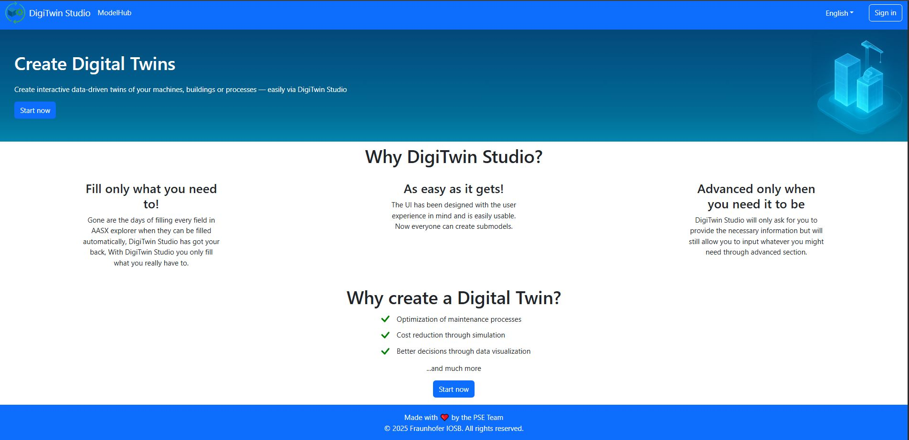
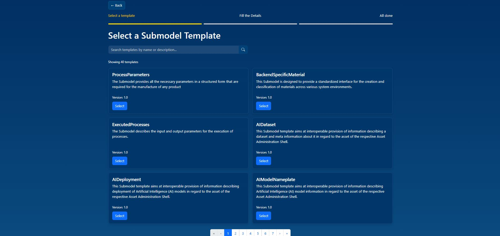
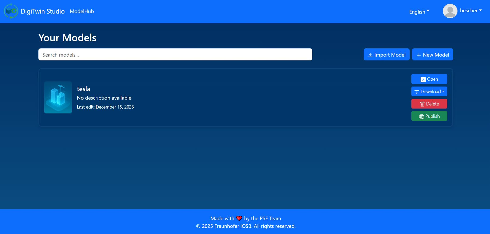

# 🌐 DigiTwin Studio - Digital Twin Submodel Instantiation Platform

A modern, full-stack web application for creating and managing Digital Twin Asset Administration Shell (AAS) models. Built with React, Spring Boot, Keycloak, and MongoDB, fully containerized with Docker and deployed on Railway.

[](https://bescher-digitwins.up.railway.app)
[](https://github.com/Bescher-Kilani/DigiTwin-Studio)
[](https://github.com/Bescher-Kilani)





---

## 🚀 Features

- **📋 Template Management** - Automated retrieval of latest Submodel-Templates from IDTA repository
- **👥 User Authentication** - OAuth2/JWT with Keycloak for secure user management
- **🎯 Intuitive Form Interface** - Simplified AAS model creation with step-by-step guidance
- **💾 Model Persistence** - Save and manage your Digital Twin models
- **📦 Export Options** - Download models in AASX or JSON format
- **🔍 ModelHub Search** - Discover and share published models with the community
- **👤 Guest Mode** - Try the platform without registration
- **🎨 Modern UI** - Responsive design with beautiful user experience

---

## 🛠️ Tech Stack

### **Frontend**
- **React 18** - Modern React with Hooks
- **Vite** - Lightning-fast build tool
- **React Router** - Client-side routing
- **Axios** - HTTP client for API calls
- **OAuth2** - Keycloak integration for authentication

### **Backend**
- **Spring Boot 3** - Java REST API
- **Spring Security** - OAuth2 resource server
- **MongoDB** - NoSQL database for model storage
- **JPA/Hibernate** - For Keycloak PostgreSQL persistence
- **Maven** - Dependency management
- **Lombok** - Reduce boilerplate code

### **Authentication**
- **Keycloak 26** - Identity and Access Management
- **PostgreSQL 16** - Keycloak database
- **OAuth2/JWT** - Token-based authentication
- **PKCE Flow** - Secure authorization code flow

### **DevOps**
- **Docker** - Containerization
- **Docker Compose** - Multi-container orchestration
- **Railway** - Cloud deployment platform
- **Nginx** - Production web server for frontend

---

## 📦 Architecture

```
┌──────────────────┐      ┌──────────────────┐      ┌──────────────────┐
│   React + Vite   │      │   Spring Boot    │      │     MongoDB      │
│   (Port 3000)    │─────▶│   (Port 8080)    │─────▶│   (Port 27017)   │
│   Nginx Server   │      │    REST API      │      │    Database      │
└──────────────────┘      └──────────────────┘      └──────────────────┘
         │                         │                          │
         │                         ▼                          │
         │                ┌──────────────────┐               │
         └───────────────▶│    Keycloak      │◀──────────────┘
                          │   (Port 8080)    │
                          │   Auth Server    │
                          └──────────────────┘
                                   │
                          ┌──────────────────┐
                          │   PostgreSQL     │
                          │   (Port 5432)    │
                          │ Keycloak DB      │
                          └──────────────────┘
                                   │
                          ─────────────────────
                             Railway Cloud
```

---

## 🐳 Docker Setup

This project uses **Docker Compose** for local development with multi-container orchestration:

### **Services Architecture**

- **Frontend**: React app with Nginx (Port 3000)
- **Backend**: Spring Boot REST API (Port 8080)
- **Keycloak**: Authentication server (Port 8081)
- **MongoDB**: Application database (Port 27017)
- **PostgreSQL**: Keycloak persistence (Port 5432)

### **Container Networking**

Services communicate via Docker's internal network:
```
frontend → backend:8080
backend → keycloak:8080 (internal)
backend → mongodb:27017
keycloak → postgres:5432
```

---

## 🚀 Quick Start

### **Prerequisites**
- Docker Desktop (or Docker Engine + Docker Compose)
- Git

### **1. Clone the Repository**
```bash
git clone https://github.com/Bescher-Kilani/DigiTwin-Studio.git
cd DigiTwin-Studio
```

### **2. Configure Environment Variables**
Create a `.env` file in the root directory:

```env
# Frontend
VITE_API_URL=http://localhost:8080
VITE_KEYCLOAK_URL=http://localhost:8081
VITE_KEYCLOAK_REALM=digitwin
VITE_KEYCLOAK_CLIENT_ID=digitwin-client

# Backend
SPRING_DATA_MONGODB_URI=mongodb://mongodb:27017/digitwin
KEYCLOAK_AUTH_SERVER_URL=http://keycloak:8080
KEYCLOAK_REALM=digitwin

# Keycloak
KEYCLOAK_ADMIN=admin
KEYCLOAK_ADMIN_PASSWORD=admin
KC_DB_URL=jdbc:postgresql://postgres:5432/keycloak
KC_DB_USERNAME=keycloak
KC_DB_PASSWORD=keycloak
KC_HOSTNAME_STRICT=false
KC_HOSTNAME_STRICT_HTTPS=false
KC_HTTP_ENABLED=true
KC_PROXY=edge

# PostgreSQL (Keycloak)
POSTGRES_DB=keycloak
POSTGRES_USER=keycloak
POSTGRES_PASSWORD=keycloak
```

### **3. Start with Docker Compose**
```bash
# Build and start all services
docker-compose up --build -d

# View logs
docker-compose logs -f

# View specific service logs
docker-compose logs -f backend

# Stop all services
docker-compose down

# Stop and remove volumes (⚠️ deletes all data)
docker-compose down -v
```

### **4. Access the Application**
- **Frontend**: http://localhost:3000
- **Backend API**: http://localhost:8080
- **Backend Health**: http://localhost:8080/actuator/health
- **Keycloak Admin**: http://localhost:8081/admin (admin/admin)

### **5. Initial Setup**
The Keycloak realm is automatically configured on first startup. No manual configuration needed!

---

## 🌐 Deployment

### **Railway Deployment**

This project is deployed on Railway with automatic CI/CD:

**Live Application**: [https://bescher-digitwins.up.railway.app](https://bescher-digitwins.up.railway.app)

#### **Deployment Architecture**

Railway services:
1. **Frontend** - React app with Nginx
2. **Backend** - Spring Boot API
3. **Keycloak** - Authentication service
4. **MongoDB** - Application database
5. **PostgreSQL** - Keycloak database

#### **Environment Configuration**

**Frontend:**
```env
VITE_API_URL=https://backend-production.up.railway.app
VITE_KEYCLOAK_URL=https://keycloak-production.up.railway.app
VITE_KEYCLOAK_REALM=digitwin
VITE_KEYCLOAK_CLIENT_ID=digitwin-client
```

**Backend:**
```env
SPRING_DATA_MONGODB_URI=mongodb://mongo.railway.internal:27017/digitwin
KEYCLOAK_AUTH_SERVER_URL=https://keycloak-production.up.railway.app
KEYCLOAK_REALM=digitwin
FRONTEND_URL=https://bescher-digitwins.up.railway.app
```

**Keycloak:**
```env
KC_HOSTNAME_URL=https://keycloak-production.up.railway.app
KC_DB_URL=jdbc:postgresql://postgres.railway.internal:5432/railway
KC_PROXY=edge
KC_HTTP_ENABLED=true
KC_HOSTNAME_STRICT=false
```

#### **Deployment Process**

1. **Push to GitHub** - Commit and push to `main` branch
2. **Automatic Build** - Railway detects changes and triggers build
3. **Docker Build** - Services are built from Dockerfiles
4. **Health Checks** - Railway verifies service health
5. **Live Deployment** - Updated services go live automatically

---

## 📁 Project Structure

```
DigiTwin-Studio/
├── frontend/                          # React Frontend
│   ├── src/
│   │   ├── components/                # React components
│   │   │   ├── auth/                  # Authentication components
│   │   │   │   ├── AuthProvider.jsx   # Keycloak integration
│   │   │   │   └── ProtectedRoute.jsx # Route protection
│   │   │   ├── dashboard/             # User dashboard
│   │   │   │   └── Dashboard.jsx      # Model management
│   │   │   ├── model/                 # Model creation
│   │   │   │   ├── TemplateSelector.jsx
│   │   │   │   ├── ModelForm.jsx
│   │   │   │   └── ModelSuccess.jsx
│   │   │   ├── modelhub/              # Model sharing
│   │   │   │   └── ModelHub.jsx       # Browse published models
│   │   │   ├── Home.jsx               # Landing page
│   │   │   └── Header.jsx             # Navigation
│   │   ├── services/                  # API services
│   │   │   ├── api.js                 # Backend API calls
│   │   │   └── keycloak.js            # Keycloak config
│   │   ├── App.jsx                    # Router setup
│   │   └── main.jsx                   # Entry point
│   ├── public/                        # Static assets
│   ├── nginx.conf                     # Nginx configuration
│   ├── Dockerfile                     # Production build
│   ├── package.json
│   └── vite.config.js
│
├── backend/                           # Spring Boot Backend
│   ├── src/main/java/com/digitwin/
│   │   ├── controller/                # REST controllers
│   │   │   ├── ModelController.java   # Model CRUD operations
│   │   │   ├── TemplateController.java # Template management
│   │   │   └── HealthController.java  # Health checks
│   │   ├── service/                   # Business logic
│   │   │   ├── ModelService.java      # Model operations
│   │   │   ├── TemplateService.java   # Template fetching
│   │   │   └── ExportService.java     # AASX/JSON export
│   │   ├── repository/                # MongoDB repositories
│   │   │   └── ModelRepository.java
│   │   ├── model/                     # Data models
│   │   │   ├── AASModel.java
│   │   │   ├── Submodel.java
│   │   │   └── Template.java
│   │   ├── security/                  # OAuth2 configuration
│   │   │   └── SecurityConfig.java    # Keycloak integration
│   │   └── DigiTwinApplication.java
│   ├── src/main/resources/
│   │   └── application.properties     # Spring configuration
│   ├── Dockerfile                     # Production build
│   └── pom.xml                        # Maven dependencies
│
├── keycloak/                          # Keycloak Configuration
│   ├── realm-export.json              # Realm configuration
│   └── Dockerfile                     # Custom Keycloak image
│
├── docs/                              # Documentation
│   └── images/                        # Screenshots
│       ├── 1_landing_page.jpg
│       ├── 2_signin_options.jpg
│       ├── 3_template_selection.jpg
│       ├── 4_model_form.jpg
│       ├── 5_model_created.jpg
│       ├── 6_dashboard.jpg
│       └── 7_aasx_explorer.jpg
│
├── docker-compose.yml                 # Local development setup
├── .env.example                       # Environment template
├── .gitignore
└── README.md
```

---

## 🔧 API Endpoints

### **Model Management**

| Method | Endpoint | Description | Auth Required |
|--------|----------|-------------|---------------|
| `POST` | `/api/models` | Create new model | ✅ |
| `GET` | `/api/models` | Get user's models | ✅ |
| `GET` | `/api/models/{id}` | Get specific model | ✅ |
| `PUT` | `/api/models/{id}` | Update model | ✅ |
| `DELETE` | `/api/models/{id}` | Delete model | ✅ |
| `POST` | `/api/models/{id}/publish` | Publish to ModelHub | ✅ |
| `GET` | `/api/models/public` | Browse published models | ❌ |

### **Template Management**

| Method | Endpoint | Description | Auth Required |
|--------|----------|-------------|---------------|
| `GET` | `/api/templates` | List all templates | ❌ |
| `GET` | `/api/templates/{id}` | Get template details | ❌ |
| `GET` | `/api/templates/refresh` | Refresh from IDTA | ✅ Admin |

### **Export**

| Method | Endpoint | Description | Auth Required |
|--------|----------|-------------|---------------|
| `GET` | `/api/export/aasx/{id}` | Download as AASX | ✅ |
| `GET` | `/api/export/json/{id}` | Download as JSON | ✅ |

### **Health Check**

| Method | Endpoint | Description |
|--------|----------|-------------|
| `GET` | `/actuator/health` | Service health status |

---

## 🔐 Authentication Flow

### **OAuth2 PKCE Flow with Keycloak**

```
┌─────────┐                                      ┌──────────┐
│ Browser │                                      │ Keycloak │
└────┬────┘                                      └────┬─────┘
     │                                                 │
     │ 1. Login Request                               │
     ├────────────────────────────────────────────────▶
     │                                                 │
     │ 2. Login Page                                  │
     │◀────────────────────────────────────────────────┤
     │                                                 │
     │ 3. Credentials                                 │
     ├────────────────────────────────────────────────▶
     │                                                 │
     │ 4. Authorization Code                          │
     │◀────────────────────────────────────────────────┤
     │                                                 │
     │ 5. Exchange Code for Token                     │
     ├────────────────────────────────────────────────▶
     │                                                 │
     │ 6. Access Token + Refresh Token                │
     │◀────────────────────────────────────────────────┤
     │                                                 │
     │ 7. API Request with Token                      │
     ├─────────────────────────▶┌──────────┐         │
     │                           │ Backend  │         │
     │                           └────┬─────┘         │
     │                                │               │
     │                                │ 8. Validate   │
     │                                ├───────────────▶
     │                                │               │
     │                                │ 9. Valid      │
     │                                │◀───────────────┤
     │ 10. API Response              │               │
     │◀─────────────────────────────┤               │
```

### **Token Management**

- **Access Token**: Valid for 5 minutes
- **Refresh Token**: Valid for 30 minutes
- **Auto-refresh**: Frontend automatically refreshes expired tokens
- **Secure Storage**: Tokens stored in Keycloak session

---

## 🏥 Health Monitoring

### **Check Application Health**

**Local Development:**
```bash
# Backend health check
curl http://localhost:8080/actuator/health

# Frontend availability
curl http://localhost:3000

# Keycloak health
curl http://localhost:8081/health/ready
```

**Production (Railway):**
```bash
# Backend health check
curl https://backend-production.up.railway.app/actuator/health

# Frontend availability
curl https://bescher-digitwins.up.railway.app
```

### **Health Check Components**

- **MongoDB Connection** - Database connectivity status
- **Keycloak Integration** - OAuth2 server availability
- **Disk Space** - Available storage
- **Memory Usage** - JVM heap status

---

## 🧪 Development

### **Run Services Individually**

**Backend Only:**
```bash
cd backend
./mvnw spring-boot:run
```

**Frontend Only:**
```bash
cd frontend
npm install
npm run dev
```

**Keycloak Only:**
```bash
docker-compose up keycloak postgres -d
```

### **Database Management**

**MongoDB:**
```bash
# Connect via CLI
docker exec -it digitwin-mongodb mongosh

# Use database
use digitwin

# View collections
show collections

# Query models
db.models.find().pretty()
```

**PostgreSQL (Keycloak):**
```bash
# Connect via CLI
docker exec -it digitwin-postgres psql -U keycloak -d keycloak

# View tables
\dt

# View users
SELECT * FROM user_entity;
```

---

## 🐛 Troubleshooting

### **Docker Compose Issues**

**Problem**: Keycloak fails to start
```bash
# Check if PostgreSQL is ready
docker-compose logs postgres

# Restart Keycloak after PostgreSQL is ready
docker-compose restart keycloak

# Check Keycloak logs
docker-compose logs -f keycloak
```

**Problem**: Frontend can't reach backend
```bash
# Verify network connectivity
docker network inspect digitwin-network

# Check backend is running
curl http://localhost:8080/actuator/health

# Rebuild frontend with correct API URL
docker-compose up --build frontend
```

**Problem**: MongoDB connection refused
```bash
# Check MongoDB status
docker-compose ps mongodb

# Restart MongoDB
docker-compose restart mongodb

# View MongoDB logs
docker-compose logs -f mongodb
```

### **Authentication Issues**

**Problem**: Token validation fails
```bash
# Verify Keycloak is accessible from backend
docker exec digitwin-backend curl http://keycloak:8080/realms/digitwin

# Check backend logs for JWT errors
docker-compose logs -f backend | grep JWT

# Verify issuer URI matches
# In browser: http://localhost:8081/realms/digitwin/.well-known/openid-configuration
```

**Problem**: Infinite login redirect
```bash
# Clear browser cache and cookies
# Chrome: Ctrl+Shift+Delete

# Check Keycloak valid redirect URIs
# Admin Console → Clients → digitwin-client → Valid Redirect URIs

# Verify frontend callback URL
# Should be: http://localhost:3000/*
```

### **Railway Deployment Issues**

**Problem**: Environment variables not loaded
```bash
# Check Railway service variables
railway variables

# Verify build-time vs runtime variables
# VITE_ variables must be set BEFORE build

# Redeploy with correct variables
railway up --detach
```

**Problem**: Keycloak hostname issues
```bash
# Verify proxy settings
KC_PROXY=edge
KC_HOSTNAME_STRICT=false
KC_HTTP_ENABLED=true

# Check Keycloak logs
railway logs -s keycloak

# Test external access
curl https://keycloak-production.up.railway.app/realms/digitwin
```

---

## 🎯 TODOs

### **Core Features**
- [ ] **Chatbot Integration** - AI assistant for model creation guidance
- [ ] **Open Model Feature** - View and edit existing models in the interface
- [ ] **Import Model** - Upload and import existing AASX/JSON files

---

## 🙏 Acknowledgments

- [IDTA](https://industrialdigitaltwin.org/) - Asset Administration Shell specifications and templates
- [Fraunhofer IOSB](https://www.iosb.fraunhofer.de/) - Project supervision and support
- [Keycloak](https://www.keycloak.org/) - Identity and Access Management
- [Railway](https://railway.app) - Cloud hosting platform
- [Spring Boot](https://spring.io/projects/spring-boot) - Backend framework
- [React](https://react.dev) - Frontend library
- [MongoDB](https://www.mongodb.com/) - NoSQL database
- [AASX Package Explorer](https://github.com/eclipse-aaspe/package-explorer) - AAS visualization tool

---

## 📧 Contact

**Bescher Kilani**
- 🌐 GitHub: [@Bescher-Kilani](https://github.com/Bescher-Kilani)
- 📧 Email: bescher.kilani@example.com
- 💼 LinkedIn: [Bescher Kilani](https://linkedin.com/in/bescher-kilani)

**Project Links**
- 🔗 Repository: [https://github.com/Bescher-Kilani/DigiTwin-Studio](https://github.com/Bescher-Kilani/DigiTwin-Studio)
- 🚀 Live Demo: [https://bescher-digitwins.up.railway.app](https://bescher-digitwins.up.railway.app)

---

## 📜 License

This project is developed for educational purposes as part of the **"Praxis der Softwareentwicklung"** course at Fraunhofer IOSB Karlsruhe.

---

## 🌟 Star this repo if you found it helpful!

**Made with ❤️ by Bescher Kilani**

---

## 📚 Additional Resources

- [Asset Administration Shell Specifications](https://www.plattform-i40.de/IP/Redaktion/EN/Standardartikel/specification-administrationshell.html)
- [IDTA Submodel Templates](https://industrialdigitaltwin.org/content-hub/teilmodelle)
- [Keycloak Documentation](https://www.keycloak.org/documentation)
- [Spring Security OAuth2](https://spring.io/guides/tutorials/spring-boot-oauth2)
- [MongoDB Documentation](https://docs.mongodb.com/)
- [Railway Deployment Guide](https://docs.railway.app/)
